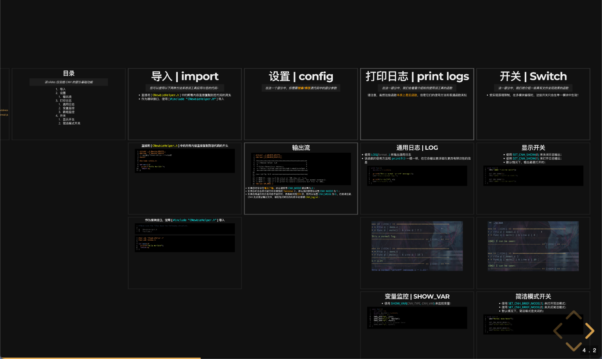
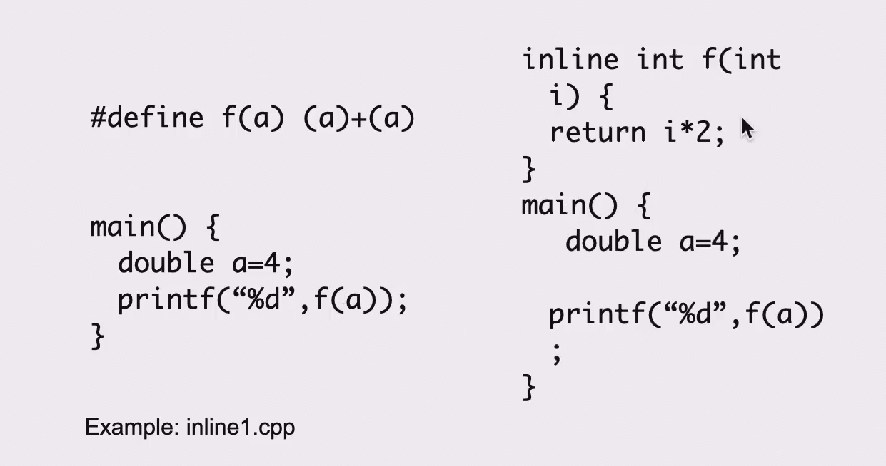

# 开始 Record
> 功能测试 

1. admonition
> [Material for mkdocs](https://squidfunk.github.io/mkdocs-material/reference/admonitions/)
!!! info "测试"
    - hhh
    - www
    - xxx
  
2. 可折叠的代码块

???+ summary "课程介绍"
    这是一个课程介绍的示例。在这里，你可以写一些关于课程的详细信息。

    - 课程名称：Python编程基础
    - 课程时长：10周
    - 课程内容：
        - Python语法
        - 数据结构
        - 函数与模块
        - 文件操作
        - 异常处理
        - 面向对象编程

    希望你能喜欢这个课程！

> ???+ 代表一个展开的折叠快, ???- 代表一个折叠的折叠快
3. 内嵌代码 and 代码高亮

```c++
    #include<>
    int main()
    {
        return 0;
    }
```

4. 删除线
   ~~删除~~
5. latex 渲染
   
!!! note "Latex 测试"
    Here is an inline math formula: $E=mc^2$
    And here is a block math formula:
    
    $$
    \int_{-\infty}^{\infty} e^{-x^2} dx = \sqrt{\pi}
    $$

1.  选项卡式的内容展示
    
???+ eg "🌰"

    === "题面"

        现在有两个程序 A 和 B，以及两个分别独立的设备 X 和 Y，且我们只有一个 CPU：

        - A 需要顺序使用如下资源：CPU: 10s, X: 5s, CPU: 5s, Y: 10s, CPU: 10s
        - B 需要顺序使用如下资源：X: 10s, CPU: 10s, Y: 5s, CPU: 5s, Y: 10s 

        请讨论：
        
        1. 在单道程序环境下先执行 A 再执行 B，CPU 的利用率是多少？
        2. 在多道程序环境下，CPU 的利用率是多少？请给出甘特图。

    === "解析"

        在单道程序下执行，即按顺序执行 A 和 B，CPU 的利用率即实际 CPU 使用时间除以完成任务的总时间，因此：

        $$
        U = \frac{(10+5+10)+(10+5)}{(10+5+5+10+10)+(10+10+5+5+10)} = \frac{40}{80} = 50\%
        $$

        ---

        而在多道程序环境下，我们得到如下甘特图：

        <figure markdown>
        <center> { width=80% } </center>
        蓝/CPU，绿/X，黄/Y。
        </figure>

        > 要点就是纵向不能同时出现同一个资源，例如 18s 时不能 A 和 B 都用 CPU，所以 A 需要等 B 用完 CPU 再使用。

        现在我们再来统计 CPU 的利用率：

        $$
        U = \frac{10+10+5+5+10}{45} = \frac{40}{45} = 88.89\%
        $$

    通过这道题我们也可以发现，多道程序设计技术对 CPU 利用率的提升有多高，同时也可以从计算过程中的分母看出其对程序吞吐量的提升有多高。

1.   图片
  

1.    emoji 
    :smile:

2.    创建带有复选框的内容展示
    - [x] 把博客大致内容做好
    - [ ] 弄一些模板，快速开始

3.  强调效果
    *h*
    **hh**
    ***hhh***
4.  缩写提示:
    *[HTML]: HyperText Markup Language
    *[CSS]: Cascading Style Sheets
    *[JS]: JavaScript


[^1]: 这个是脚注一
[^2]: 这个是脚注二